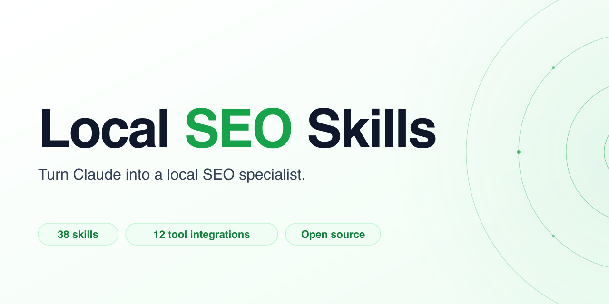

<p align="center">
  
</p>

<p align="center">
  <a href="https://github.com/garrettjsmith/localseoskills/blob/main/LICENSE"></a>
  <a href="https://github.com/garrettjsmith/localseoskills/stargazers"></a>
  <a href="https://claude.com/claude-code"></a>
  <a href="https://agentskills.io/specification.md"></a>
</p>

# Open-Source Claude SEO Tool for Local Search

<p align="center">
  <strong>38 open-source skills that turn Claude into a local SEO specialist.</strong><br/>
  Connect your data tools, describe a business, Claude audits it, monitors it, reports on it, and executes.
</p>

<p align="center">
  <strong>Works with:</strong>
  Claude Code · Claude Desktop · Claude.ai · Cursor · Codex · OpenClaw · Antigravity · any <a href="https://agentskills.io/specification.md">Agent Skills</a>-compatible agent
</p>

<p align="center">
  <em>If Local SEO Skills saves you time, star the repo. It's how other practitioners find it.</em>
</p>

---

## What Makes This Different

Most skill libraries stop at instructions. Local SEO Skills adds the three things that turn instructions into an actual operating system for client work:

- **Persistent briefs.** Every client and location has a living file Claude reads and updates automatically. Ask "why did rankings drop in March?" six months into an engagement and get a real answer from the history.
- **Scheduled tasks that run while you sleep.** 15 task templates with autonomous, queue, and notify approval tiers. Monitoring, reports, drafts, and alerts keep running when your laptop is closed.
- **A data layer built for local, not bolted on.** The default is [LocalSEOData](https://localseodata.com): 36 endpoints for SERP, GBP, reviews, citations, geogrid, and AI visibility through one MCP connection. Specialist tools (Ahrefs, Semrush, Local Falcon) slot in where LocalSEOData doesn't cover.

---

## Table of Contents

- [Install](#install)
- [Quick Start](#quick-start)
- [What's Inside](#whats-inside)
- [Briefs](#briefs)
- [Scheduled Tasks](#scheduled-tasks)
- [Default Data Source: LocalSEOData](#default-data-source-localseodata)
- [Why This Exists](#why-this-exists)
- [How It Works](#how-it-works)
- [Strategy Skills](#strategy-skills)
- [Tool Skills](#tool-skills)
- [Foundational Docs](#foundational-docs)
- [Community](#community)
- [License](#license)

---

## Install

Pick the path for your setup. However you install, the 38 skills end up where your agent can find them.

### Claude Code (CLI, recommended)

```bash
/plugin marketplace add garrettjsmith/localseoskills
/plugin install local-seo-skills@garrettjsmith-localseo
```

Full brief experience. Claude reads and writes `briefs/` on your filesystem, so history compounds automatically across sessions.

### Claude Desktop or Claude.ai in Chrome

Open Settings → Customize → Plugins → add marketplace `garrettjsmith/localseoskills` → install **local-seo-skills**. Three clicks.

Briefs require filesystem access. In Desktop, Claude can read and write briefs in any folder you grant access to; in Claude.ai in the browser, briefs are session-scoped and you paste them back into your Project between sessions. For the full persistent-brief experience, use Claude Code (CLI).

### Terminal one-liner (macOS / Linux)

```bash
curl -fsSL https://raw.githubusercontent.com/garrettjsmith/localseoskills/main/install.sh | bash
```

### Windows (PowerShell)

```powershell
git clone https://github.com/garrettjsmith/localseoskills.git
powershell -ExecutionPolicy Bypass -File localseoskills\install.ps1
```

### Claude.ai web (without Desktop)

Open Claude in Chrome and paste:

```
Go to github.com/garrettjsmith/localseoskills, find all the SKILL.md files, and
add them to my Claude Skills or a new Project called "Local SEO Skills".
```

Claude handles the import. Takes 60-90 seconds. One time.

### Cursor, Codex, OpenClaw, or any Agent Skills-compatible agent

```bash
git clone https://github.com/garrettjsmith/localseoskills.git ~/.agents/skills/localseoskills
```

Skills are platform-agnostic markdown. Any agent that reads the [Agent Skills spec](https://agentskills.io/specification.md) can use them as context.

---

## Quick Start

Before your first audit, connect a data source. [LocalSEOData](https://localseodata.com) is the default and covers 36 endpoints in one MCP connection — see [Default Data Source](#default-data-source-localseodata) below for the setup link. Without a data source connected the skills still load, but the first audit will fail with a clear message telling you which MCP is missing.

Once installed and connected, just mention any local business. Claude picks the right skills automatically.

```
You: "Audit Mike's Plumbing in Buffalo"
→ brief asks 5 quick questions
→ local-seo-audit + localseodata-tool (citation_audit, reputation_audit)
→ 47 issues found · report drafted · brief initialized

You: "Why am I not in the map pack?"
→ gbp-optimization + localseodata-tool (local_pack, business_profile)
→ top 3 issues identified · fix priority ordered

You: "Run a geogrid scan for 'plumber near me' in Buffalo"
→ geogrid-analysis + localseodata-tool (geogrid_scan)
→ 169-point grid rendered · ARP / ATRP / SoLV computed

You: "How do I show up in ChatGPT for local searches?"
→ ai-local-search + localseodata-tool (ai_visibility, ai_mentions)
→ 4 AI platforms scanned · mention gaps surfaced

You: "Pick up where we left off on Keystone Insurance"
→ brief reads prior state across 3 locations
→ summary of where we stopped · asks what's next
```

---

## What's Inside

- **26 strategy skills:** GBP optimization, audits, citations, reviews, keywords, geogrid, content, AI visibility, multi-location SEO, client deliverables, a dispatch router that picks the right skills for every request, and more
- **12 tool skills:** MCP integrations for [LocalSEOData](https://localseodata.com), Local Falcon, LSA Spy, SerpAPI, Semrush, Ahrefs, BrightLocal, DataForSEO, Whitespark, Google Search Console, Google Analytics, and Screaming Frog
- **15 scheduled task templates:** monitoring, reporting, execution, and prospecting workflows that run on Anthropic's cloud, even when your computer is off
- **1 brief system:** persistent work state per business and location, compounding history over time
- **3 foundational docs:** how local search works, glossary, and tool routing
- **20 years of local SEO practice**, encoded as markdown any agent can read

No SaaS infrastructure. No servers. Runs on tools you already have connected.

---

## Briefs

Briefs are persistent work state for local SEO engagements. Claude creates and maintains them automatically, one per location. When you mention a business for the first time, Claude asks 5 questions, runs an initial audit, sets up the brief, and offers to configure scheduled tasks. No manual setup.

```
briefs/
  keystone-insurance/
    _brand.brief.md          # config + rollup across all locations
    buffalo/
      location.brief.md      # always current, always lean
      reports/               # weekly, monthly, QBR
      scans/                 # geogrid, citations, page audits
      drafts/                # GBP posts, review responses (awaiting approval)
      alerts/                # monitoring alerts
```

After months of scheduled tasks writing to a brief, you can ask *"why did rankings drop in March?"* and get a real answer from the history.

Briefs are gitignored. Client data never touches the repo. See [briefs/README.md](briefs/README.md) for the full system.

---

## Scheduled Tasks

15 task templates that turn Local SEO Skills into always-on local SEO software. Tasks run on Anthropic's cloud infrastructure. No server required, works even when your computer is off.

### Approval Tiers

| Tier | How it works | Used for |
|------|--------------|----------|
| **Autonomous** | Runs, writes output, notifies | Monitoring, reporting, audits |
| **Queue** | Drafts, holds for approval, then executes | GBP posts, review responses, content |
| **Notify** | Confirms before AND after | Client emails, live GBP pushes |

### Task Templates

| ID | Task | Schedule | Tier |
|----|------|----------|------|
| M1 | Weekly Rankings Monitor | Weekly, Monday 7am | Autonomous |
| M2 | Review Velocity Monitor | Weekly, Monday 7am | Autonomous |
| M3 | GBP Change Monitor | Daily, 8am | Autonomous |
| M4 | LSA Rankings Monitor | Weekly, Monday 7am | Autonomous |
| M5 | AI Visibility Monitor | Monthly, 1st at 8am | Autonomous |
| E1 | GBP Post Drafts | Monthly, 1st at 8am | Queue |
| E2 | Review Response Drafts | Weekly, Tuesday 8am | Queue |
| E3 | Citation Audit | Quarterly, 1st of Jan/Apr/Jul/Oct | Autonomous |
| E4 | Local Page Content Audit | Quarterly, 1st of Jan/Apr/Jul/Oct | Queue |
| R1 | Weekly Performance Report | Weekly, Monday 8am (after M1 + M2) | Autonomous |
| R2 | Monthly Client Report | Monthly, 1st at 9am | Notify |
| R3 | Multi-Location Rollup | Monthly, 1st at 10am (after R2) | Autonomous |
| R4 | Quarterly Business Review | Quarterly, 1st of Jan/Apr/Jul/Oct, 8am | Queue |
| P1 | Prospect Audit | On demand | Autonomous |
| P2 | Competitor Market Monitor | Monthly, 1st | Autonomous |

See [tasks/](tasks/) for individual task files and [specs/](specs/) for the approval workflow.

---

## Default Data Source: LocalSEOData

[LocalSEOData](https://localseodata.com) is the default data tool for Local SEO Skills. One MCP connection, 36 endpoints across SERP data, business intelligence, audits, reviews, citations, keywords, AI visibility, competitor analysis, and geogrid scans.

Other tools (Local Falcon, Ahrefs, Semrush, and the rest) are positioned as specialists for things LocalSEOData doesn't cover: geogrid trend reports, deep backlink analysis, full site crawls, and actual traffic data.

See [docs/tool-routing.md](docs/tool-routing.md) for the full decision tree.

---

## Why This Exists

Local SEO is a workflow problem, not a data problem. The data is already out there. What agencies and practitioners actually need is a system that remembers what happened last month, runs audits on schedule, drafts review responses, catches GBP changes, and compounds history across client engagements without stacking another SaaS subscription on top.

Local SEO Skills is that system. Open-source markdown any agent can read.

Built by [Garrett Smith](https://garrettsmith.com), 20+ years in SEO as practitioner, consultant, CMO, and agency owner. Built for both single-location SMBs and multi-location brands.

---

## How It Works

```
Mention a business       →   brief handles first-run setup
    ↓                         ↓
Claude reads the brief   →   skills dispatch against your data tools
    ↓                         ↓
Results update the brief →   scheduled tasks keep it current
    ↓
Ask anything about the engagement; history compounds over time
```

With Local SEO Skills fully configured:

- Monitors rankings weekly and alerts you when they move
- Monitors reviews daily and drafts responses to unanswered ones for your approval
- Catches GBP changes immediately and flags unauthorized edits
- Generates monthly reports and queues them for approval before they go to clients
- Runs quarterly audits across citations, content, and competitive position
- Builds searchable history across every engagement

---

## Strategy Skills

| Skill | Description |
|-------|-------------|
| [gbp-optimization](skills/gbp-optimization) | Google Business Profile setup, optimization, and map pack visibility |
| [gbp-posts](skills/gbp-posts) | GBP post strategy, templates, and scheduling |
| [gbp-suspension-recovery](skills/gbp-suspension-recovery) | GBP suspension prevention and reinstatement |
| [gbp-api-automation](skills/gbp-api-automation) | GBP API and bulk management for enterprise |
| [geogrid-analysis](skills/geogrid-analysis) | Map pack ranking analysis using geogrid scans and ARP/ATRP/SoLV |
| [local-seo-audit](skills/local-seo-audit) | Comprehensive local search presence audit |
| [local-competitor-analysis](skills/local-competitor-analysis) | Local pack competitor analysis and benchmarking |
| [local-content-briefs](skills/local-content-briefs) | Generate semantic content briefs for local SEO content |
| [local-content-strategy](skills/local-content-strategy) | Local content strategy, topic clusters, and editorial planning |
| [local-reporting](skills/local-reporting) | Local SEO metrics, multi-location reporting, and ROI |
| [local-keyword-research](skills/local-keyword-research) | Local keyword research, geo-modified keywords, intent classification |
| [client-deliverables](skills/client-deliverables) | Audit reports, proposals, scopes of work, competitive reports |
| [local-landing-pages](skills/local-landing-pages) | Location pages, service-area pages, and local content strategy |
| [service-area-seo](skills/service-area-seo) | SEO for service-area businesses without a storefront |
| [review-management](skills/review-management) | Review generation, response strategy, and reputation |
| [local-citations](skills/local-citations) | NAP consistency, citation building, and directory management |
| [local-link-building](skills/local-link-building) | Local backlink acquisition and digital PR |
| [local-schema](skills/local-schema) | LocalBusiness structured data and location schema |
| [lsa-ads](skills/lsa-ads) | Google Local Services Ads (pay-per-lead, Google Guaranteed) |
| [local-search-ads](skills/local-search-ads) | Ads inside the Google Maps local pack |
| [local-ppc-ads](skills/local-ppc-ads) | Geographically targeted Google Ads |
| [apple-business-connect](skills/apple-business-connect) | Apple Maps optimization and Apple Business Connect |
| [bing-places](skills/bing-places) | Bing Maps optimization and Bing Places for Business |
| [ai-local-search](skills/ai-local-search) | AI Overviews, ChatGPT, Gemini, Copilot for local |
| [multi-location-seo](skills/multi-location-seo) | Managing SEO across 10-500+ locations at scale |
| [dispatch](skills/dispatch) | Routes requests to the right skill combination |

---

## Tool Skills

| Skill | Tool | What It Covers |
|-------|------|----------------|
| [localseodata-tool](skills/localseodata-tool) | **LocalSEOData** | **Default.** 36 endpoints: SERP data, business profiles, reviews, citations, audits, keywords, AI visibility, geogrid scans, competitor analysis |
| [local-falcon-tool](skills/local-falcon-tool) | Local Falcon | Geogrid trend reports, recurring campaigns, Falcon Guard (GBP monitoring), AI platform scans |
| [lsa-spy-tool](skills/lsa-spy-tool) | LSA Spy | LSA market-level ranking tracking and competitive intelligence over time |
| [serpapi-tool](skills/serpapi-tool) | SerpAPI | Live SERP data (fallback if LocalSEOData not connected, or for non-Google engines) |
| [semrush-tool](skills/semrush-tool) | Semrush | Advanced keyword gap analysis, Keyword Magic Tool, site audit |
| [ahrefs-tool](skills/ahrefs-tool) | Ahrefs | Deep backlink analysis, anchor text, lost links, referring domain details |
| [brightlocal-tool](skills/brightlocal-tool) | BrightLocal | Citation building/submission, review monitoring dashboards |
| [dataforseo-tool](skills/dataforseo-tool) | DataForSEO | Massive bulk operations (1000+ queries), raw API for custom pipelines |
| [whitespark-tool](skills/whitespark-tool) | Whitespark | Citation building, review generation campaigns (Reputation Builder) |
| [google-search-console-tool](skills/google-search-console-tool) | Google Search Console | Actual organic search performance: clicks, impressions, CTR |
| [google-analytics-tool](skills/google-analytics-tool) | Google Analytics (GA4) | Real traffic, user behavior, conversions |
| [screaming-frog-tool](skills/screaming-frog-tool) | Screaming Frog | Full site technical crawls, custom extraction at scale |

---

## Foundational Docs

| Doc | Description |
|-----|-------------|
| [how-local-search-works](docs/how-local-search-works.md) | The ranking model, how the map pack gets assembled, how citations, reviews, and links affect rankings |
| [local-seo-glossary](docs/local-seo-glossary.md) | Every acronym and concept: ARP, ATRP, SoLV, NAP, SAB, LSA, and 80+ more |
| [tool-routing](docs/tool-routing.md) | Which tool to use for which task: LocalSEOData as default, specialists for gaps |

---

## Community

Join the [Discord](https://discord.gg/BFtGYWBmDw) for freelancers, consultants, and small agencies using Claude as their operating system for local SEO.

Contributions welcome. See [CONTRIBUTING.md](CONTRIBUTING.md) for the skill authoring guide.

Issues and feature requests: [GitHub Issues](https://github.com/garrettjsmith/localseoskills/issues).

Support: [help@localseoskills.com](mailto:help@localseoskills.com).

---

## Security & Privacy

Vulnerability reports: see [SECURITY.md](SECURITY.md). For a private channel, use [GitHub Security Advisories](https://github.com/garrettjsmith/localseoskills/security/advisories/new).

Data handling (what the skills read/write, what leaves your machine, what doesn't): see [PRIVACY.md](PRIVACY.md).

Contributor guide: see [CONTRIBUTING.md](CONTRIBUTING.md) and the [Code of Conduct](CODE_OF_CONDUCT.md).

---

## License

MIT. See [LICENSE](LICENSE).

Built by [Garrett Smith](https://garrettsmith.com).
